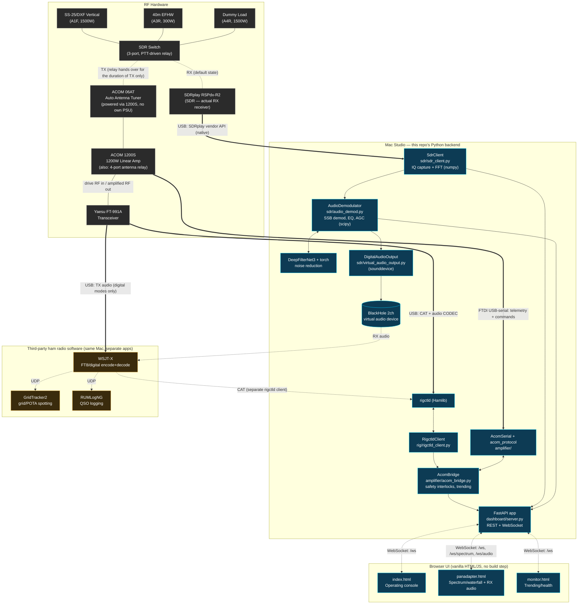
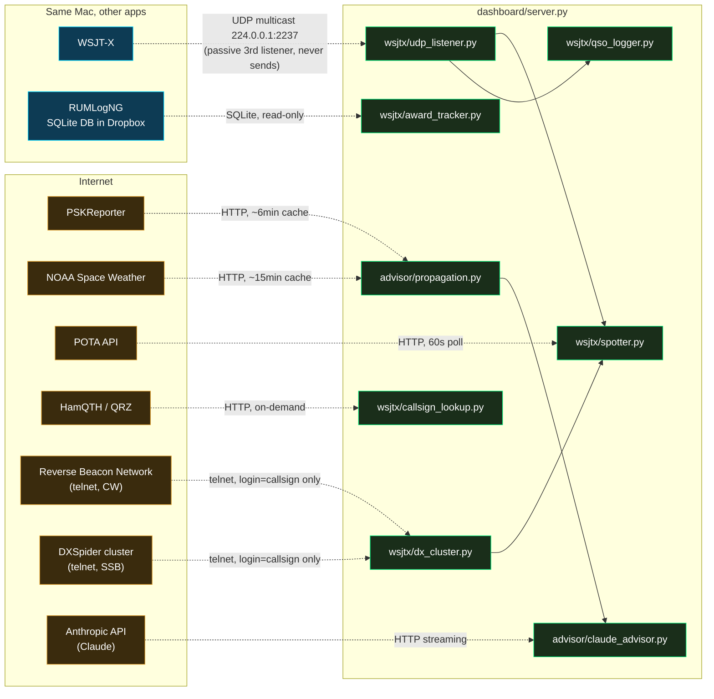

# Architecture

Internal design reference for w7tlg-console. For setup, hardware, and operating instructions see [README.md](README.md).

## Overview

The console is a single FastAPI process that owns three persistent hardware connections — Hamlib `rigctld` (TCP), the ACOM 1200S (serial), and the SDRplay RSPdx-R2 (native vendor API) — and fans state out to any number of browser tabs over WebSocket. Station state itself is in-memory for the life of the process, no database; but the console also *reads* two external stores directly — RUMLogNG's own SQLite logbook (read-only, for award tracking) and WSJT-X's local ADIF file (fallback) — see "External Data Sources" below.

Beyond the original rig/amp/SDR core, the console also owns four more persistent connections that don't touch RF hardware at all: a WSJT-X UDP multicast listener, a Reverse Beacon Network telnet client (CW spots), a DXSpider cluster telnet client (SSB spots), and periodic HTTP polling (PSKReporter, NOAA, POTA) — plus on-demand HTTP calls (HamQTH/QRZ lookups, Anthropic for the AI advisor). All of these are deliberately isolated from the safety-critical rig/amp path: failure to connect (network down, a service unreachable) logs a warning and degrades that one feature, it never blocks startup or affects TX/RX. See "External Data Sources" below for the full list and "Known limitations" for what's approximate/best-effort about each.

**The browser side is a single-window shell over the same backend, not one page per feature.** `dashboard/console.html` (route `/console`) is a persistent, resizable panadapter pane plus a tabbed right pane (Dashboard/Monitor/Propagation/Spot-Seek/AI Advisor), built from iframes pointing at the same standalone pages that also still work in their own browser tab (`/`, `/panadapter`, `/monitor`, `/propagation`, `/spotseek`, `/advisor`). This is deliberate, not incidental: `panadapter.html` and `index.html` each carry a lot of hard-won, safety-tuned logic (TX audio mute timing, feedback-loop prevention, digital-mode view locking) as top-level global-scope JS variables — merging them into one page's shared scope risked silent variable collisions and regressions in exactly the code that must not regress. Iframes give true isolation (separate `window` scope, separate WebSocket connections) at the cost of some redundant `/ws` traffic, which is irrelevant for a single-operator LAN console. It also solves trend-CSV logging "for free": a hidden-but-mounted iframe keeps its JS and WebSocket running, so `trend_csv_logger.py`'s existing heartbeat gate now effectively means "runs whenever the console shell is open," not "whenever `/monitor` specifically is the visible tab" — no code changes needed there at all.

**The SDR, not the radio's own receiver, is what's actually heard.** Under this station's SDR Switch wiring, the antenna is on the RSPdx-R2 for RX; the radio's own receive antenna port sees nothing except briefly during TX (when the switch hands the antenna to the TX chain). `rig.strength_db`/the radio's own AGC are therefore dead for anything audible — RX audio, S-meter, and noise reduction/EQ all come from the SDR's own demodulation (`sdr/audio_demod.py`), not the FT-991A. This same SDR audio also feeds digital-mode software (WSJT-X etc.) over a virtual audio cable (`sdr/virtual_audio_output.py`), so voice and digital modes share one RX path with no antenna/hardware switch between them — see "Digital Mode Integration" in [README.md](README.md).

```
        ┌──────────┐   ┌──────────────────┐   ┌──────────────┐
        │ rigctld  │   │   ACOM 1200S     │   │  RSPdx-R2    │
        │ (Hamlib) │   │  (serial/RS232)  │   │ (native API) │
        └────┬─────┘   └────────┬─────────┘   └──────┬───────┘
          TCP:4532          binary frames          IQ stream
             │                   │                     │
        ┌────▼─────┐    ┌────────▼────────┐    ┌───────▼────────┐
        │RigctldCl.│    │   AcomSerial    │    │   SdrClient     │
        │ rig/     │    │   amplifier/    │    │ sdr/            │
        └────┬─────┘    └────────┬────────┘    └───────┬─────────┘
             │ state callbacks    │ telemetry/fault/      │ spectrum frames
             │                    │ antenna-change          │ + AudioDemodulator
             └──────────┬─────────┘                         │ (EQ/NR/AGC, voice
                        ▼                                   │ <-> digital profile)
                ┌─────────────────┐                         │
                │   AcomBridge     │  safety interlocks,    │
                │ amplifier/       │  trending, duty cycle   │
                │ acom_bridge.py   │                         │
                └────────┬─────────┘                         │
                         │ StationState                      │
                         ▼                                   │
                ┌─────────────────────────────────────────────▼──┐
                │                FastAPI app                     │  REST + WebSocket
                │              dashboard/server.py               │
                └────────┬──────────────┬──────────────┬─────────┘
                         │ state/cmd     │ spectrum     │ audio
                         ▼               ▼              ▼
                index.html (/)   panadapter.html   monitor.html
                operating console  (/panadapter)    (/monitor)
                                                          │
                                                          ▼ (also)
                                              DigitalAudioOutput → BlackHole
                                              → WSJT-X/digital-mode software
```

## System Diagram (hardware + software, full stack)

The diagram above is software-only. This one adds the RF hardware chain and the third-party ham radio software that shares the Mac with this console — i.e. the whole station, not just this repo.



Solid lines in the RF subgraph are fixed RF coax runs; dotted lines are the SDR Switch's relay fork (one or the other, never both); `==>` are physical USB/serial links into the Mac; dotted arrows elsewhere are software-level connections (WebSocket, CAT-over-TCP, UDP). GridTracker2/RUMLogNG's own rigctld/UDP connections exist but aren't this repo's concern, so they're only sketched at the WSJT-X boundary — see the README's "Operating" section for the full third-party chain.

## External Data Sources

A separate diagram from the RF/hardware one above — none of this touches the radio or the amp, and all of it is designed to fail independently without affecting rig/amp safety paths.



Every arrow into this subsystem is either read-only (RUMLogNG's SQLite, opened `mode=ro`) or a login-only/no-write connection (WSJT-X multicast — joins the group, never sends; RBN/DXSpider — sends only the operator's callsign to log in, never posts a spot). Nothing in this diagram can affect the radio; the only path from here to the rig is the AI advisor's optional, off-by-default auto-QSY tool call, which goes through the same `RigctldClient.set_frequency()`/`set_mode()` the rest of the console already uses — not a separate/bypass path.

## Modules

### `rig/rigctld_client.py`
Async TCP client speaking the Hamlib rigctld text protocol to the FT-991A (model 1035). Polls on an interval (default 0.5s) and exposes `RigState` — frequency, mode, S-meter, PTT, DSP settings (NB, DNR level, DNF, AGC), mic gain, compression, `is_digital`/`near_digital_freq`. `update_derived()` computes band and display-formatted frequency from raw Hz and derives `is_digital` from the rig's actual Hamlib mode strings (`PKTUSB`/`PKTLSB` — confirmed via `rigctl --dump-caps -m 1035`; plain `USB`/`LSB` are voice, not digital, despite the name similarity). Notifies subscribers via `on_state_change(cb)`.

`send_raw_cmd()` is a Hamlib raw-CAT passthrough (`w <cmd>`) for parameters not exposed as a standard Hamlib level on this rig — currently used for `get_dt_gain()`/`set_dt_gain()`, which read/write CAT menu **073 "DATA OUT LEVEL"** (operators call this "DT GAIN" — the digital-mode TX audio drive level from USB/DATA into the modulator; not menu 049 "AM DATA GAIN", which is unrelated/AM-only). Identified from the official Yaesu FT-991A CAT manual and live-verified against the real rig: `w EX073;` returns the radio's raw echo, e.g. `EX073030;`.

### `sdr/sdr_client.py`, `sdr/audio_demod.py`, `sdr/virtual_audio_output.py`
Owns the SDRplay RSPdx-R2 session (native vendor callback thread → bounded queue → dedicated consumer thread → asyncio, see inline comments for the thread-bridge rationale) and turns its IQ stream into both spectrum frames (for the panadapter) and demodulated audio.

`AudioDemodulator` (`audio_demod.py`) demodulates one SSB channel and runs it through a small audio chain: decimate → SSB bandpass filter (passband `[low_cut_hz, low_cut_hz + bandwidth_hz]`) → 3-band EQ (RBJ cookbook shelf/peak biquads, `sosfilt` with state carried across blocks) → noise reduction (DeepFilterNet3, run on a rolling ~0.4s window rather than per-block — the model resets its own hidden state on every call, so feeding it this file's tiny ~8ms blocks directly would reset context constantly; see the docstring on `_apply_nr`) → AGC (time-constant-based, not a fixed per-call fraction, so behavior stays correct regardless of block size) → manual gain → hard limiter. `enter_digital_mode()`/`exit_digital_mode()` snapshot and force this chain to a different profile (AGC off, NR/EQ bypassed, passband widened to start at the dial frequency) — driven by `RigState.is_digital` transitions, wired in `dashboard/server.py`'s `on_rig_state_for_audio_mode`.

`DigitalAudioOutput` (`virtual_audio_output.py`) is a second, always-on subscriber on the same `AudioDemodulator.on_audio()` hook the browser uses — it resamples to 48kHz and writes to a virtual audio device ("BlackHole 2ch") so digital-mode software can use the SDR's RX audio as its soundcard input, instead of the antenna needing to be switched back to the radio's own receiver. TX is unaffected — digital-mode software still drives the radio's USB Audio CODEC for transmit audio.

**Digital-mode fine spectrum.** `AudioDemodulator` also runs a second, much finer-resolution FFT (4096-point, ~3.9Hz/bin) directly on its own decimated 16kHz baseband — the same signal already used for SSB demod, already centered exactly on the dial frequency, so no separate retuning concept is needed the way the wideband capture has one. Only computed while `in_digital_mode` (set by `enter_digital_mode()`/`exit_digital_mode()`); 4-frame exponential-power averaged (same technique as `SdrClient`'s wideband averaging, reset at the start of each RX cycle so it never blends stale pre-transmission content into a new one) to cut flicker, matching WSJT-X's own spectrum display. Published via `on_fine_spectrum(cb)`, wired in `SdrClient.__init__` straight into the same `_publish`/`on_spectrum` fan-out the wideband frames use, distinguished only by a `"kind": "fine"` tag on the frame dict — `panadapter.html` renders from whichever frame kind is active for the current mode, and locks the view to exactly 3000Hz wide with the dial pinned to the left edge while in digital mode (enforced every tick in `handleDigitalViewMode()`, frozen during TX so it doesn't chase WSJT-X's own small dial wobble around each transmission — see the project's Claude memory `project_wsjtx_rigctld_gotchas` for why that wobble exists and how to recognize it).

### `amplifier/acom_protocol.py`
Pure protocol library, no I/O. Encodes/decodes the ACOM binary frame format (`0x55` start byte, address, length, data, checksum). Defines the message address space (`AmpMsg` amp→computer, `CmdMsg`/`AmpCmd` computer→amp), amplifier mode codes (`STB`, `OPR_RX`, `OPR_TX`, `ATAC`, `TURN_OFF`, `TX_PROHIBIT`/`TX_ALLOW`), and the band table. `FULL_TELEMETRY` (`0x2F`) is the primary 72-byte-on-wire (68-byte payload) telemetry message sent ~10x/sec; the `0x23`–`0x26` legacy messages are superseded by it.

`ANT_BAND_SELECT` (`0x09`) drives two independent, non-obvious behaviors confirmed against an engineer-supplied v1.3 protocol doc plus live hardware (see Known Limitations below for the full story):
- `cmd_next_antenna()` — Byte5=`0x30`, cycles to the next antenna exactly like the amp's front-panel ANT button. There is no direct "select antenna N" (Byte4, the antenna number, is ignored by firmware) and no "previous antenna."
- `cmd_select_band(band)` — Byte5=raw band number (`0x01`–`0x0A`). Not in the documented Byte5 value list for this sub-command (which only enumerates the cycle codes), but required in practice: it's the only way the amp's band/LPF tracks the radio while in STANDBY, since its own RF frequency counter has nothing to detect without drive power.

### `amplifier/acom_serial.py`
Async serial port owner (`pyserial` under asyncio). Opens the FTDI device exclusively, frames/deframes bytes per `acom_protocol`, and fires `on_telemetry`, `on_fault`, `on_antenna_change`, `on_connection_change` callbacks. `find_acom_port()` exists for auto-detection but the README explicitly warns against relying on it when multiple FTDI devices are present — `ACOM_PORT` in `dashboard/server.py` is hardcoded instead.

### `amplifier/acom_bridge.py`
The coordinator — the only module that knows about both the rig and the amp at once. Responsibilities:
- **`OperatingMode`** state machine: `AMP_OFF` (RF bypass, 100W rig limit, safe default) ↔ `AMP_ON` (amp in circuit, 40W drive limit, requires `confirmed=True` from the caller).
- **TX inhibit**: driven only by the amp's own firmware-computed hard/soft fault bits (message `0x21`), the dummy-load 10s hard cutoff, serial connection loss, or manual operator action — see "Safety interlocks" below. Reflected power/SWR is *not* an inhibit source; it's a passive operator notification only (`swr_warning_active`/`swr_warning_peak` on `StationState`, computed from the amp's own reported SWR, threshold 2.5) — an earlier console-side "2x reflected-power baseline" auto-inhibit heuristic was removed after it falsely tripped on normal variation and had no reliable way to clear.
- **Trending**: a `deque(maxlen=6000)` ring buffer of `TrendSample` at ~10Hz (~10 min window) plus a separate 5-min duty-cycle sample buffer; `get_trend_data(since)` serves incremental updates to `/monitor`.
- **TX cycle counting** and **duty-cycle calculation** (`_calc_duty_cycle`).
- **`StationState`**: the single flat dataclass that represents everything a browser needs to render — rig sub-state plus amp telemetry (fwd/refl power, SWR, drive, temp, HV, current), fault lists (hard/soft/warnings + overall `fault_severity`), operating mode, selected antenna, drive limit, TX inhibit state, duty cycle, dummy-load timer, SWR warning. `to_dict()` is what actually goes over the wire.
- Antenna selection is **cycle-only, driven both ways**: `next_antenna()` sends the same forward-cycle command as the front-panel ANT button; `_on_antenna_change` updates `selected_antenna` from the amp's `0x27` feedback regardless of which side triggered the change, so the console stays in sync either way. Note the amp's built-in 4 relay antennas report 0-indexed in `0x27` (`ant_num + 1` in `_on_antenna_change`) — confirmed against real hardware, contrary to the protocol doc's generic `[1..10]` wording (which describes the ASEL 10-antenna accessory case).

### `amplifier/antenna_ab_test.py`
`AntennaAbTest` drives a receive-only comparison across antennas. For each antenna in a round, `_profile_band()` re-sweeps every channel in a caller-given frequency range against `SdrClient.passband_strength_db()` for a configurable dwell, building a `[time, channel]` history — equivalent to a long-exposure waterfall, but as exact dB floats instead of palette-quantized pixels. A channel qualifies as active if its 90th-percentile level (the level when a fluctuating voice/CW/FT8 signal is actually "on") sits ≥6dB above its own time-median (`ACTIVE_CHANNEL_THRESHOLD_DB`) — this is deliberately not the median itself, since the median is biased by however much of the dwell window happened to be "off". Antenna moves go through `AcomBridge.goto_antenna()` (added alongside this module) rather than blind `next_antenna()` calls, since the test needs a specific target antenna and a hard guarantee the switch actually landed.

After all rounds complete, `_compute_summary()` matches channels that were active on **both** antennas within the **same round** (channel grid is deterministic given the same scan range/bandwidth, so frequency floats compare exactly) and averages the signal/floor/SNR deltas across every match — this is the actual "which antenna is better" answer, as opposed to the raw per-channel rows, which only show what was heard where. Both the per-channel `StepResult` rows and the summary are written incrementally to CSV (`data/ab_tests/`) as the test runs, so a stop or crash mid-run doesn't lose completed rounds.

`goto_antenna()` (on `AcomBridge`) is the one new piece of antenna-switching logic this added: unlike `next_antenna()` (fire-and-forget, mirrors the front-panel button), `goto_antenna(target)` cycles forward — re-sending `cmd_next_antenna()` with retries if telemetry confirmation doesn't arrive — until `_selected_antenna` matches `target`, checking TX state/amp connection/fault status before every hop so a multi-hop traversal (e.g. A3R back to A1F necessarily passes through A4R, the dummy load, since the relay is forward-only) can't continue blind into a fault or into TX.

### `amplifier/trend_csv_logger.py`
`TrendCsvLogger` persists `AcomBridge`'s existing in-memory `TrendSample`s (otherwise lost on restart) to CSV. Liveness is heartbeat-based rather than tied to a WebSocket connection object: `dashboard/monitor.html` sends a `monitor_heartbeat` ws command every 4s, `server.py`'s `_monitor_liveness_watcher()` task starts/stops the logger based on whether a heartbeat arrived in the last 10s. This indirection exists because `/monitor` shares `/ws` with the dashboard — there's no way to tell "a monitor tab is open" from connection state alone, since a dashboard-only connection looks identical. Since `/console`'s Monitor tab is a hidden-but-mounted iframe rather than a closed connection when another tab is active, this heartbeat keeps arriving for as long as the console shell itself is open — no changes needed here for that to work.

### `config/station_profile.py`
`StationProfileManager` holds two hardcoded `StationProfile` records (La Quinta CA, Boise ID — grid/call/city/state each) and the currently-selected one, persisted to `data/station_profile.json` (only written on an actual change, not on every read). A module-level singleton (`station_profile`), read by `advisor/propagation.py` (grid for PSKReporter queries), `advisor/claude_advisor.py` (location context in the system prompt), `advisor/monitor.py` (alert text), and `wsjtx/dx_cluster.py`/`wsjtx/award_tracker.py`-adjacent code that needs "my callsign." Deliberately a manual toggle, not auto-detected (e.g. from IP geolocation) — a wrong auto-detection would silently corrupt QTH-dependent data (award/confirmation records) with no obvious symptom, which is worse than requiring one click.

### `wsjtx/protocol.py`
Pure binary parser for WSJT-X's UDP message format (no sockets) — built directly from WSJT-X's own `Network/NetworkMessage.hpp` source, not reimplemented from memory or guessed. A `_Reader` class handles the big-endian QDataStream primitives (`u8`/`u32`/`u64`/`i32`/`f64`/`utf8` with the `0xffffffff`-means-null-string sentinel/`qtime_ms`). `parse_message()` dispatches on message type; only the types this console actually consumes are fully parsed (`Heartbeat`, `Status`, `Decode`, `LoggedAdif`, `Clear`, `Close`) — others return `None` per the protocol's own compatibility rule that unknown types must be silently ignored, not treated as an error. `QsoLogged` (type 5) is deliberately *not* fully parsed — its `QDateTime` fields have a fiddly variable-length wire encoding, and `LoggedAdif` (type 12) carries the same QSO as ready-to-parse ADIF text including plain `QSO_DATE`/`TIME_ON`/`TIME_OFF` fields, which is what `wsjtx/qso_logger.py` actually uses.

### `wsjtx/udp_listener.py`
`WsjtxListener` joins WSJT-X's own multicast group (`224.0.0.1:2237` on `lo0`, per this station's `WSJT-X.ini` — confirmed live, not assumed) as a passive third listener alongside RUMLogNG/GridTracker2, using `SO_REUSEADDR`/`SO_REUSEPORT` so all three processes can bind the same port. Read-only by design — never sends anything back to WSJT-X (no `Reply`/`HaltTx`/`FreeText`/`Configure`), so there's no way for this to interfere with actual operation. Dispatches parsed messages via `on_heartbeat`/`on_status`/`on_decode`/`on_logged_adif` callback registration, same pattern as `AcomBridge.on_state_change`. Validated two ways before being trusted: a hand-built, protocol-exact synthetic packet sent to the same multicast group (confirms the parser byte-for-byte), and live traffic from the actual running station (confirms the socket/multicast mechanics end-to-end).

### `wsjtx/adif.py`
Minimal ADIF record parser (`<field:length>value` tags, `<eor>`/`<eoh>` markers) — not a full spec implementation, just enough for what WSJT-X and RUMLogNG actually write. Used by `award_tracker.py`'s WSJT-X-ADIF fallback path and by `LoggedAdif` message handling.

### `wsjtx/award_tracker.py`
`AwardTracker` answers "what states/DXCC entities have I worked" for the Spot/Seek tab. Tries RUMLogNG's own SQLite database first (`reload()` → `_load_from_rumlogng()`), falling back to WSJT-X's local ADIF log if that path is unreachable. The RUMLogNG path opens the database read-only (`file:...?mode=ro`) since it's RUMLogNG's own live, actively-open file — never risk a write or lock conflict against it. Only unambiguous fields are used: worked status (a QSO record existing), `band`, `dxccadif` (the numeric DXCC entity ID, the canonical field — `dxcc`, the prefix string, is kept alongside for display only), `state`. The `logbook` table's `qsl`/`lotwqsl`/`eqsl` columns are deliberately *not* used for confirmed-vs-worked tracking — checked directly against the real database and found to be `'W'` for literally every row, meaning whatever they encode isn't a per-QSO confirmation flag despite the names. The `prefs` table (RUMLogNG's own app settings, including the operator's actual LoTW/eQSL account credentials in plain columns) is never queried. `worked_dxcc_entities()`/`dxcc_summary_by_band()` report worked counts only — no "missing DXCC" list, since that needs a complete current DXCC entity reference table this module doesn't have (unlike states, where the 50-entry `ALL_US_STATES` constant makes "missing" trivial to compute).

### `wsjtx/qso_logger.py`
`QsoTelemetryLogger` keeps a throttled (~1Hz) rolling buffer of `TelemetrySample`s, fed from the *existing* `AcomBridge.on_state_change` stream (which fires far more often than 1Hz) rather than a second independent poller. On each `LoggedAdif` event, parses the ADIF for `QSO_DATE`/`TIME_ON`/`QSO_DATE_OFF`/`TIME_OFF` (UTC), slices the buffer to that exact window, and computes min/avg/max per numeric field (fwd/refl power, SWR, temp, drive, HV, current, SDR S-meter) plus start-value/changed-flag for categorical fields (band, mode, antenna, etc.). Appends one JSON object per QSO to `data/qso_performance_log.jsonl` — JSONL specifically chosen (not a single JSON array, not CSV) so the field list can grow over time without needing to migrate old records or agree on a fixed column set up front. This is a diagnostic record for studying station/rig/band performance, explicitly not a logbook — RUMLogNG remains authoritative for that.

### `tools/qso_log_to_csv.py`
Standalone script, not imported by the running console. Flattens the JSONL log's nested structure into dotted column names (`telemetry.fwd_w.max`, etc.) and takes the union of every column seen across the whole file as the CSV header — rows from before a field existed just get a blank cell for it, rather than the conversion breaking or needing the schema to be fixed in advance.

### `wsjtx/spotter.py`
`Spotter` is the alert-dispatch hub for Spot/Seek — one `on_alert(cb)` registration point consumed regardless of which of three upstream sources triggered the alert: `on_decode()` (WSJT-X FT8/digital, via regex callsign/grid extraction from the free-text decode message — a heuristic, not a full parser of every WSJT-X message grammar, deliberately over-matching rather than risking a missed spot), `on_cluster_spot()` (RBN/DXSpider, see `dx_cluster.py`), and the POTA poll loop (`_poll_pota_once()`, deduplicates by `spotId` against a bounded-size seen-set). `WatchList` is a simple persisted `set[str]` (`data/watchlist.json`, same on-change-only-write pattern as `station_profile.py`). Idaho detection is a grid-boundary heuristic, not a callsign lookup — US call areas span multiple states (a W7 could be ID/WA/OR/MT/UT/NV/WY/AZ), so there's no reliable prefix-based method; instead, a decoded/spotted grid square is checked against `IDAHO_GRIDS`, the set of Maidenhead 4-char squares whose bounding box overlaps Idaho's real (irregular) border — genuinely useful but an approximation, documented as such rather than presented as certain.

### `wsjtx/callsign_lookup.py`
`CallsignLookup` — manual callsign lookup for SSB/CW, where no automated decode/grid feed exists the way WSJT-X provides for digital modes. Tries HamQTH first (free, no subscription tier gating which fields come back) via its session-key XML API, falling back to/supplementing with QRZ's XML API if configured (QRZ restricts field coverage without a paid Logbook Data subscription — this station's QRZ login currently fails outright, most likely for that reason, not investigated further since HamQTH alone covers what's needed). Both services' XML responses are namespaced (`xmlns="https://www.hamqth.com"` / QRZ's own namespace) — a real bug was hit and fixed here: `ElementTree.findtext(".//tag")` silently matches nothing against namespaced XML unless the namespace is included in the query, which produced login-succeeded-but-lookup-empty behavior until caught by testing the raw XML response directly rather than trusting the parsed result.

### `wsjtx/dx_cluster.py`
Two read-only telnet clients, both built on a shared `_TelnetSpotClient` (connect → send callsign as login → read lines → parse `DX de ...` lines → dispatch → auto-reconnect on drop): `RbnClient` (Reverse Beacon Network, `telnet.reversebeacon.net:7000`, automated CW/RTTY skimmer spots — fully machine-generated, consistent columns) and `DxClusterClient` (a DXSpider node, `dxspider.co.uk:7300`, the traditional human-operated cluster network — the only real source for SSB spots, since there's no automated way to "decode" a voice signal into a spot). Both line formats were confirmed by connecting live and reading real traffic, not guessed from documentation. DXSpider's format has no mode column (unlike RBN) — `infer_phone_mode()` approximates SSB vs. non-SSB from the spot's frequency against a coarse per-band phone-subband table, which is a real approximation (actual band plans have narrower CW/data-only slices within those ranges, and a human-typed comment can say anything) rather than authoritative. Both networks' spots feed into `Spotter.on_cluster_spot()` for the same watch-list/Idaho-grid alert logic the WSJT-X path uses.

### `advisor/propagation.py`
`PropagationSource` fetches PSKReporter (FT8 spots sent from the operator's own grid square, last 15 minutes — shows which bands currently have an open path out of this QTH) and NOAA solar indices (SFI, Kp). QTH-aware: reads `station_profile.current.grid` on every fetch (re-fetches immediately if the grid changed since the last cache, i.e. the operator switched QTH), rather than a hardcoded location the way the `ft991a-panel` code this was ported from had. Two real bugs were found and fixed porting this: NOAA's planetary-K-index and 10cm-flux endpoints have both changed response shape since the original code was written (now list-of-dicts with a `Kp` / lowercase `flux` key respectively, not the list-of-lists / `Flux` shape the old code assumed) — both were failing silently (caught by a bare `except`, returning `None`) until tested against live data rather than trusted from a code read.

### `advisor/monitor.py`
`PropagationMonitor.detect_changes()` compares successive propagation snapshots for band-opening/closing (spot-count jump/drop crossing an activity-level threshold), 10m/12m specifically lighting up, and Kp spikes — each with its own 15-minute cooldown so the same condition doesn't re-alert repeatedly. `explain_alert()` sends the alert plus current band/solar context to Claude for a 2-3 sentence explanation (a separate, smaller/cheaper call than the main advisor chat) — synchronous, run via `asyncio.to_thread` from the poll loop in `server.py`.

### `advisor/claude_advisor.py`
`ClaudeAdvisor.stream_advice_with_tools()` is the streaming chat backend for the AI Advisor tab. `format_context()` packages current rig state (this console's actual `RigState` field names — `freq_hz`/`strength_db`/`rf_power_pct`/`preamp_name`/`nb_on`/`nr_on`, not the differently-named fields the `ft991a-panel` original used) and propagation data into a prompt; `_system_prompt()` is built fresh per call from `station_profile.current` so advice reflects whichever QTH is actually selected. The one place in the whole console where an LLM can command the radio: when `auto_qsy=True` (an explicit per-request flag, never defaulted true, never persisted across page loads) the `qsy_to_band` tool is offered, and a tool-use response is executed directly against the same `RigctldClient.set_frequency()`/`set_mode()` calls the rest of the console uses — not a separate/bypass path. Anthropic's Python SDK streaming client is synchronous even on the non-async `Anthropic()` client, so the whole stream runs in a worker thread (`run_in_executor`) with chunks forwarded to the caller through an `asyncio.Queue`, keeping the public method a clean async generator without blocking the event loop.

### `dashboard/server.py`
FastAPI app. One `AcomBridge` instance and one `SdrClient` instance live in module-level `bridge`/`sdr`, constructed in the `lifespan` context manager (so serial/TCP connections open on startup and close cleanly on shutdown — important given the ACOM's DTR/RTS sensitivity, see README). A `ConnectionManager` tracks all open WebSockets and broadcasts every `StationState` change to all of them — there's no per-client filtering, every tab sees everything. Separate `SpectrumConnectionManager`/`AudioConnectionManager` handle the higher-rate panadapter spectrum/audio streams on their own WS endpoints (`/ws/spectrum`, `/ws/audio`), since those are fine to drop-if-slow where the main state stream is not. `SpectrumConnectionManager.broadcast_frame` passes through a `"kind"` tag (`"wide"` or `"fine"`) from whatever `SdrClient`/`AudioDemodulator` published, so the frontend can tell the two spectrum sources apart without a second endpoint.

`on_rig_state_for_audio_mode` is a second subscriber on `RigctldClient.on_state_change` (separate from `AcomBridge`'s own) that edge-triggers `sdr.audio.enter_digital_mode()`/`exit_digital_mode()` off `RigState.is_digital` — purely an SDR-audio concern, not a safety interlock, so it's kept out of `AcomBridge`.

REST surface (`/api/state`, `/api/mode`, `/api/antenna/next`, `/api/tx`) duplicates a subset of what's also reachable over the WebSocket command channel — REST for one-shot actions/polling, WebSocket for the live stream plus the same actions inline (`set_mode_op`, `set_frequency`, `set_mode`, `set_rf_power`, `set_preamp`, `set_mic_gain`, `set_comp`, `set_nb`, `set_audio_nr`, `set_eq`, `set_dt_gain`, `set_dnf`, `set_agc`, `set_rx_volume`, `next_antenna`, `inhibit_tx`/`allow_tx`, `get_trend`, plus the panadapter's `set_panadapter_freq`/`set_audio_target`/`set_audio_enabled`). Every WS command gets a `cmd_response` echoed back to the sender; state changes are broadcast to everyone independent of who issued the command.

**`lifespan` also owns the External Data Sources connections** (see that section above), each started after the rig/amp/SDR core and each wrapped so its own failure can't affect the others or the console's startup: `wsjtx_listener` (joins the WSJT-X multicast group; `OSError` on join is caught and logged, not raised), `rbn_client`/`dx_cluster_client` (telnet, own internal reconnect loop, never blocks startup), `spotter.start_pota_polling()` (background poll task), `claude_advisor` (constructed, not connected — Anthropic calls are on-demand per advisor request), and `_propagation_poll_loop()` (a `asyncio.create_task`, runs independently every 3 minutes). REST endpoints added alongside: `/api/station-profile` (GET/POST), `/api/propagation`, `/api/advisor/stream` (POST, Server-Sent Events) / `/api/advisor/clear`, `/api/watchlist` (GET/POST/DELETE), `/api/lookup/callsign`, `/api/awards/states` / `/api/awards/dxcc`. New broadcast message types on the same `/ws` channel as `state`: `station_profile`, `wsjtx_status`, `propagation`, `propagation_alert`, `spot_alert`.

### `dashboard/console.html`
The unified single-window shell (see "Overview" above for why it's iframe-based). Tab switching is pure CSS (`display:none`/`.active`) on already-mounted iframes, never `src` swaps — that's what keeps every tab's WebSocket connection and JS state alive in the background regardless of which tab is visually active. The panadapter pane's width and the active tab are both persisted to `localStorage` so a page reload doesn't reset the layout. Fully additive: adding this file changed nothing about `/`, `/panadapter`, `/monitor` themselves, which are exactly the same standalone pages they were before, just now also embedded here.

### `dashboard/index.html` / `dashboard/monitor.html` / `dashboard/panadapter.html`
No build step — plain HTML/CSS/JS served directly from disk by `server.py`. All three connect to `/ws` for state/commands; `monitor.html` additionally polls `get_trend` to backfill its strip charts on load/reconnect, and `panadapter.html` additionally connects to `/ws/spectrum` and `/ws/audio` for the waterfall display and RX audio playback (via an `AudioWorklet` ring buffer, immune to per-message scheduling jitter). `panadapter.html` defaults to **Audio: Live** on page load (not muted) — band changes with audio off could leave the digital-mode view showing a low-resolution crop of the wideband capture instead of the high-res "fine" spectrum, since that data is only computed server-side once audio has been enabled at least once (a byproduct of the audio demod pipeline, shared across all connected clients — unmuting from any one tab enables it for all of them). Click-to-tune is suppressed while `rigIsDigital` — the narrow 3kHz digital view meant any click landed within a few hundred Hz of the dial and silently retuned the actual rig VFO, which is disruptive to FT8/digital operation (the dial must stay fixed; decoding happens by audio offset, not by chasing signals with the tuning knob). A `pendingRetuneHz` retune-wait now has a 3s timeout so a stuck SDR-capture-window retune self-heals instead of freezing the display indefinitely.

### `dashboard/propagation.html` / `dashboard/spotseek.html` / `dashboard/advisor.html`
New pages, same no-build-step vanilla HTML/JS pattern and dark-theme CSS variable palette as the original three. `propagation.html` also owns the QTH toggle UI (POSTs `/api/station-profile`, re-renders from the `station_profile` broadcast rather than guessing the new state locally). `spotseek.html`'s manual-lookup and watch-list sections are plain `fetch()` REST calls; its Live Alerts feed listens for `spot_alert` on the shared `/ws`. `advisor.html` consumes `/api/advisor/stream`'s Server-Sent Events by hand (`fetch()` + a `ReadableStream` reader, since the standard `EventSource` API only supports GET and this endpoint is a POST) — parses `data: ` lines split on blank-line event boundaries, with `[QSY]`/`[ERROR]`/`[DONE]` as in-band markers ahead of the plain-text token stream. The Auto-QSY toggle is intentionally the loudest-styled control in the whole console (red, pulsing, impossible-to-miss when on) and resets to off on every page load — it is never persisted, since it's the one control here that lets an LLM command the radio.

## Data flow summary

1. `RigctldClient`, `AcomSerial`, and `SdrClient` each poll/listen their hardware independently and call into `AcomBridge` (rig+amp) or directly into `server.py` (SDR) via callbacks.
2. `AcomBridge` merges rig+amp into one `StationState`, applies safety logic (mode limits, TX inhibit, SWR warning), and invokes its own `on_state_change` callbacks.
3. `server.py`'s `on_station_state` handler broadcasts the new state as `{"type": "state", "data": ...}` to every connected browser; `build_state_payload` layers in SDR-derived fields (S-meter from the SDR spectrum, EQ/NR/AGC config, digital-audio feed status) since those don't live in `AcomBridge`'s `StationState`.
4. Browser-originated commands (slider drags, button clicks) go out over the same WebSocket as `{"cmd": "..."}` messages, handled by `handle_ws_command`, which calls back into `AcomBridge`/`RigctldClient`/`sdr.audio` and replies with a `cmd_response` — the resulting state change then arrives separately via the next broadcast.
5. Separately, `AudioDemodulator` fans its demodulated RX audio out to every registered subscriber — the browser (via `/ws/audio`) and `DigitalAudioOutput` (via a virtual audio cable to digital-mode software) both just subscribe to the same `on_audio()` hook; neither knows about the other.

**External data sources — same broadcast channel, different triggers:**

6. `wsjtx_listener` parses WSJT-X's UDP multicast independently of the rig/amp poll loop; `Decode` messages go to `spotter.on_decode()` (watch-list/Idaho matching), `LoggedAdif` messages go to both `qso_logger.on_logged_adif()` (telemetry-buffer slicing) and `award_tracker.reload()` (so "missing states" reflects the QSO just logged).
7. `rbn_client`/`dx_cluster_client` parse their own telnet streams independently and call `spotter.on_cluster_spot()` — the same watch-list/Idaho-grid alert logic as step 6's `Decode` path, just a different trigger (RBN/DXSpider spot vs. FT8 decode).
8. Any alert from `spotter` (watchlist/idaho/pota, regardless of which of the three sources triggered it) is broadcast as `{"type": "spot_alert", "data": ...}` — one message shape, three producers.
9. `_propagation_poll_loop()` (a standalone `asyncio.create_task`, not tied to any WebSocket connection) fetches `propagation_source.get_state()` every 3 minutes, broadcasts it as `{"type": "propagation", ...}`, runs `propagation_monitor.detect_changes()`, and — if a change fired — calls Claude for a one-line explanation and broadcasts `{"type": "propagation_alert", ...}`.
10. The AI Advisor's `/api/advisor/stream` is the one request/response (not broadcast) flow in this list: a POST triggers `ClaudeAdvisor.stream_advice_with_tools()`, which streams back over Server-Sent Events to just that one requester — other connected tabs don't see the chat unless they're the one that asked.
11. `award_tracker`/`callsign_lookup` are pull-only, never push: REST endpoints call `.reload()`/`.lookup()` synchronously on request, nothing streams from these on its own.

## Safety interlocks (where they live in code)

| Interlock | Enforced in |
|---|---|
| AMP_OFF default on boot, antenna defaults to A4R (dummy load) | `AcomBridge.__init__` / `StationState` defaults |
| AMP_ON requires explicit confirmation | `AcomBridge.set_operating_mode(confirmed=...)`, surfaced as a confirm dialog in `index.html` |
| Drive power capped per mode (100W / 40W) | `StationState.drive_limit_w`, enforced both in `set_rf_power` (server clamps `pct`) and exposed to the UI |
| TX inhibit on amp hard/soft fault, dummy-load 10s cutoff, serial loss, or manual inhibit | `AcomBridge.inhibit_tx`/`allow_tx`, called from `_on_fault`/`_dummy_load_watchdog`/`_on_amp_connection` |
| Antenna is cycle-only (no jump-to-antenna), console mirrors whichever side changed it | `next_antenna()` / `_on_antenna_change` in `acom_bridge.py` |
| Serial port opened exactly once, never re-asserted on reconnect | `acom_serial.py` connection handling — see README's "Critical Hardware Rules" for the DTR/RTS hazard this avoids |

Reflected power/SWR is deliberately *not* in this table — see the `acom_bridge.py` module note above.

## Known limitations

- **No direct antenna selection — cycle only.** The 1200S firmware has no "select antenna N" command at all (confirmed against an engineer-supplied v1.3 protocol doc, which superseded an earlier A600S-only v1.1 doc this codebase was originally built against, plus live hardware testing). The console drives antenna changes the same way the front-panel ANT button does — `cmd_next_antenna()`, forward cycling only, no "previous" — and the firmware itself skips antennas not assigned to the current band (e.g. on 40m it only toggles between two of the four). Full byte-level writeup of doc-vs-hardware discrepancies (the antenna number being ignored, the band number working despite being undocumented for this sub-command, the 0-indexed `0x27` antenna field) is in this project's Claude memory (`project_acom_1200s_protocol`), not duplicated here.
- **No automated test suite.** `tests/` contains only an empty `__init__.py`.
- **Single hardcoded serial port.** `ACOM_PORT` in `server.py` must be updated by hand when the FTDI adapter's device path changes (it has, at least twice, per git history); `find_acom_port()` exists but is unreliable with multiple FTDI devices attached.
- **DeepFilterNet adds latency, not used at its full real-time potential.** `AudioDemodulator._apply_nr` runs DeepFilterNet3 on a rolling ~0.4s window rather than true frame-at-a-time streaming, because its public `enhance()` API resets the model's hidden state on every call — calling it per-~8ms-block (this file's normal cadence) would reset that context constantly and degrade quality. The safe fix costs latency (~0.4s when NR is on) instead of the ~10-20ms the model is capable of with proper frame-level streaming against its internal (undocumented) state-carrying API. Revisit if the added latency turns out to be perceptible/annoying in practice.
- **Raw CAT passthrough (`send_raw_cmd`/DT GAIN) shares a serial link with WSJT-X and can stall for seconds.** Confirmed live: a contended `w EX073;` read blocked the shared poll connection long enough to delay PTT/frequency broadcasts by several seconds, which showed up as real TX leakage briefly rendering in the panadapter before the freeze caught up. `get_dt_gain()` now uses its own short-lived connection and is polled as a detached background task (see `rigctld_client.py`'s `_poll_dt_gain`) so it can no longer block the main poll cycle — any *future* raw-passthrough addition should follow the same pattern rather than awaiting inline.
- **RUMLogNG's per-QSO confirmation status is not decoded.** The `logbook` table's `qsl`/`lotwqsl`/`eqsl` columns are `'W'` for every row (checked directly), not a real per-QSO confirmed flag. Actual confirmation tracking appears to live in the `dxlist` table's per-band letter-grid column, format undeciphered. `award_tracker.py` reports worked-only, not confirmed-only — fine for "have I ever worked this," not for tracking what's actually eligible for award submission.
- **No "missing DXCC" list.** `award_tracker.py` reports DXCC entities *worked*, not entities *missing* — computing the latter needs a complete, current DXCC entity reference table, which isn't bundled (unlike the 50-entry US-states constant, which makes "missing states" trivial).
- **Idaho detection is a grid-boundary heuristic, not ground truth.** `wsjtx/spotter.py`'s `IDAHO_GRIDS` is a bounding-box approximation of Idaho's Maidenhead squares — the state's real border is irregular, so grids near the WA/OR/MT/WY/UT/NV edges can false-positive. Treat an "Idaho" alert as "worth a look," not certain.
- **DXSpider cluster spots have no mode field.** `wsjtx/dx_cluster.py`'s `infer_phone_mode()` guesses SSB vs. not from the spot's frequency against a coarse per-band phone-subband table — real band plans have narrower CW/data-only slices within those ranges, and a human-typed spot comment can claim anything regardless of actual frequency.
- **QRZ XML login currently fails** ("Username/password incorrect") for this station's configured account — most likely because it lacks the paid Logbook Data subscription tier QRZ's XML API requires for full access, not a credential error (the password was verified byte-for-byte against what was provided). Not investigated further since HamQTH alone covers `callsign_lookup.py`'s needs; QRZ is wired in as an optional supplement only.
- **Browser autoplay policy can silently suspend the panadapter's audio despite `audioMuted === false`.** `panadapter.html` calls `enableAudio()` on page load, but browsers block actual `AudioContext` playback until a real user gesture has occurred somewhere on the page — the button correctly shows "Audio: Live" and the server-side effect (fine-spectrum computation starting) fires regardless, since that's driven by a WebSocket message, not `AudioContext` state, but the operator may hear nothing until the first click anywhere on the page.
- **The `/console` iframe shell has some redundant WebSocket traffic and no cross-tab JS calls.** Each mounted iframe (Dashboard/Monitor/Propagation/Spot-Seek/AI-Advisor, plus the panadapter pane) opens its own `/ws` connection and receives every broadcast independently — five-plus connections doing overlapping work, acceptable overhead for a single-operator LAN console but a real inefficiency if this pattern were ever scaled to multiple simultaneous operators/browsers. Iframes also can't call each other's JS directly (would need `postMessage`) — not needed yet since no tab currently needs to trigger behavior in another, but a real constraint if that changes.
